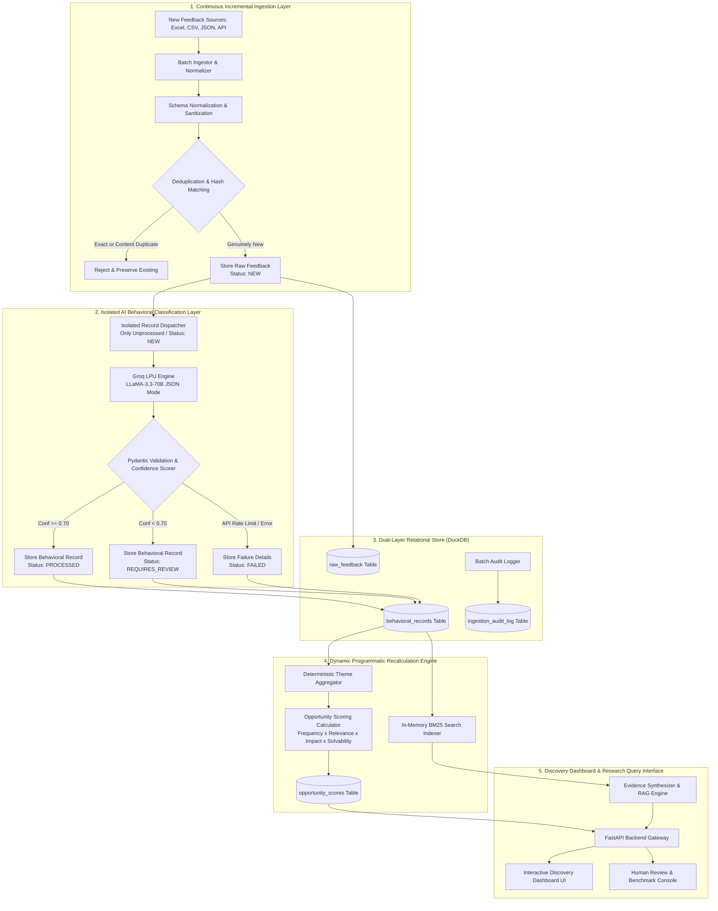
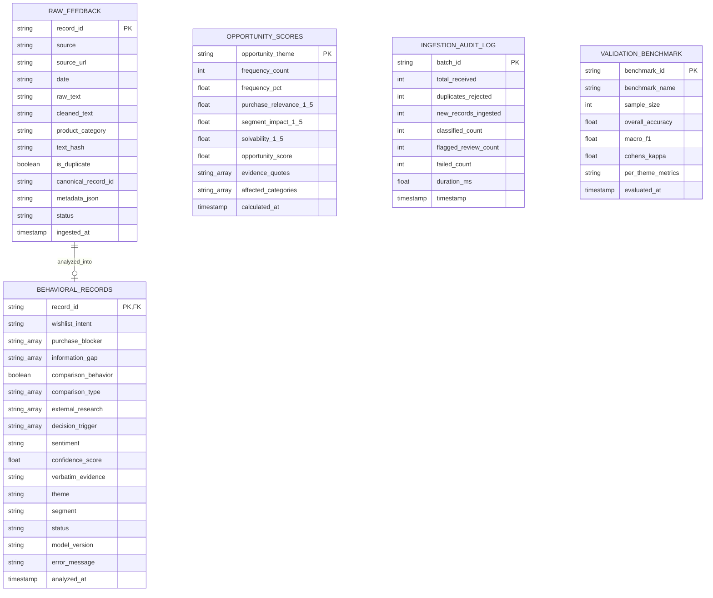

# System Architecture: AI Discovery Engine & Continuous Incremental Pipeline

> **Reference Context:** [`context.md`](file:///c:/Users/kumar/Desktop/New%20folder%20(3)/context.md) | **Problem Statement:** [`Docs/problem-statement.txt`](file:///c:/Users/kumar/Desktop/New%20folder%20(3)/Docs/problem-statement.txt) | **Incremental Ingestion Spec:** [`Docs/Update.txt`](file:///c:/Users/kumar/Desktop/New%20folder%20(3)/Docs/Update.txt)

---

## 1. Executive Summary & Design Principles

The **AI Discovery Engine** is a high-throughput, evidence-traceable intelligence pipeline designed to continuously ingest unstructured consumer feedback across public channels (Reddit, YouTube, App Stores, Communities, Reviews, Surveys) and transform it into structured, quantifiable behavioural insights regarding **beauty shopping and wishlist abandonment**.

### Core Architecture Tenets
1. **Continuous Incremental Ingestion (Zero Reprocessing)**:
   - Newly ingested batches are deduplicated in $O(1)$ time against existing IDs and composite content hashes (`source + URL + normalized text + date`).
   - Only genuinely new records are sent to the AI classifier. Previously processed historical records remain locked, saving LLM tokens and maintaining historical stability.
2. **Strict Separation of AI vs. Deterministic Computing**:
   - **AI Layer** performs semantic extraction, qualitative classification, intent identification, and natural-language synthesis.
   - **Deterministic Layer** handles all statistical counts, aggregations, frequency calculations, segment slicing, deduplication, and mathematical opportunity scoring to prevent hallucinated numbers.
3. **Immutable Traceability & Audit Lineage**:
   - Every metric, cluster, and insight links directly to supporting verbatim evidence quotes, confidence scores, source URLs, model versions, and batch execution logs.
4. **Resilient Failure Recovery & Containment**:
   - Classification failures are contained with explicit `FAILED` status and captured error messages without losing raw data or duplicating records upon retry.

---

## 2. High-Level Architecture & Incremental Pipeline Flow

---

## 3. Detailed Component Breakdown

### 3.1 Ingestion & Preprocessing Layer
- **Input Handlers**:
  - `BatchIngestor`: Multi-format parsing for Excel (`.xlsx`, `.xls`), CSV, and JSON payloads with flexible column synonym resolution.
- **Deduplication Engine**:
  - Exact `record_id` match.
  - Composite SHA-256 content hash matching: `MD5(source + source_url + cleaned_text + date)`.
  - Fuzzy Jaccard token similarity ($\ge 0.85$ threshold) to catch slight comment edits.
- **Zero Historical Reprocessing Isolation**:
  - Database queries `SELECT record_id FROM raw_feedback WHERE is_duplicate = FALSE AND record_id NOT IN (SELECT record_id FROM behavioral_records WHERE status = 'PROCESSED')`.
  - Guarantees 0 redundant LLM calls on historical records.

---

### 3.2 AI Behavioral Classification Layer
- **LLM Orchestration (Groq LPU Engine)**:
  - Powered by **Groq** (`llama-3.3-70b-versatile` / `llama-3.1-8b-instant`) for ultra-low latency, high-throughput behavioral classification.
  - Native structured output enforcement using `response_format={"type": "json_object"}` and Pydantic validation schemas.
  - Concurrency pool (`ThreadPoolExecutor`) with automatic retry and error handling.
  - High-precision heuristic fallback engine for offline or rate-limited environments.
- **Classification Taxonomies**:
  - **Wishlist Intent**: `GENUINE_PURCHASE_INTENT`, `BOOKMARK`, `COMPARISON`, `WAITING_FOR_RIGHT_TIME`, `WAITING_FOR_BETTER_VALUE`, `INSPIRATION`, `FUTURE_NEED`, `UNCERTAIN`, `OTHER`.
  - **Purchase Blocker**: `SHADE`, `PRICE_VALUE`, `PRICE`, `FINISH`, `SUITABILITY`, `QUALITY`, `QUALITY_TRUST`, `REVIEWS_SOCIAL_PROOF`, `COMPARISON`, `ALTERNATIVE_FOUND`, `FORGOT`, `TIMING_OCCASION`, `AVAILABILITY`, `RETURNS`, `TRUST`, `NO_NEED`, `SIZE_FORMAT`, `INGREDIENT_SAFETY`, `PACKAGING`, `PERFORMANCE_DOUBT`, `OTHER`.
  - **Information Gap**: `SHADE_CONFIDENCE`, `PRODUCT_QUALITY`, `PERFORMANCE`, `SUITABILITY`, `INGREDIENTS`, `PRICE_VALUE`, `REVIEWS`, `RETURN_POLICY`, `DELIVERY`, `SOCIAL_PROOF`, `COMPARISON`, `OTHER`.
  - **Comparison Behavior**: Boolean flag + `[OTHER_BRAND, SAME_PRODUCT_OTHER_PLATFORM, SIMILAR_PRODUCT, PRICE, OFFER, DELIVERY, RETURNS, QUALITY, REVIEWS, OTHER, NONE]`.
  - **External Research Source**: `[NONE, GOOGLE, YOUTUBE, INSTAGRAM, REDDIT, OTHER_MARKETPLACE, OFFLINE_STORE, FRIENDS, OTHER]`.
  - **Decision Trigger**: `[LOWER_PRICE, BETTER_VALUE, BETTER_REVIEWS, SHADE_CONFIRMATION, SUITABILITY_CONFIDENCE, PRODUCT_DEMO, BETTER_ALTERNATIVE, AVAILABILITY, OCCASION, REPLENISHMENT, SOCIAL_PROOF, OTHER]`.
- **Lifecycle State Machine**:
  - `NEW`: Ingested into raw store, awaiting classification.
  - `PROCESSING`: Undergoing active inference.
  - `PROCESSED`: Successfully classified (Confidence $\ge 0.70$).
  - `REQUIRES_REVIEW` (or `NEEDS_REVIEW`): Low confidence ($< 0.70$), routed to QA console.
  - `FAILED`: Classification error captured, eligible for safe retry.
  - `HUMAN_APPROVED`: Verified or updated by human researcher.

---

### 3.3 Dynamic Programmatic Recalculation Engine
- **Deterministic Analytics Aggregator**:
  - Calculates exact theme distributions, blocker frequencies, information gap prevalence, and channel patterns in SQL.
- **Opportunity Scoring Calculator**:
  - Computes opportunity priority ranking deterministically:
    $$\text{Opportunity Score} = \left(\frac{\text{Theme Count}}{\text{Total Analyzed Records}}\right) \times \text{Relevance} \times \text{Impact} \times \text{Solvability} \times 10$$
  - Persists rankings into `opportunity_scores` table upon every incremental batch.
- **Incremental BM25 Search Indexer**:
  - Rebuilds in-memory inverted indices and BM25 term weights across raw statements, verbatim quotes, categories, and themes.

---

### 3.4 Research Query Layer (RAG)
- **Natural Language Assistant**:
  - Sub-second BM25 hybrid document retrieval filtered by category or theme.
  - Evidence synthesizer generates structured answers strictly grounded in retrieved quotes with record ID citations (`[Record #INC011]`).

---

### 3.5 Validation, QA & Audit Layer
- **100-Sample Benchmark Evaluator**:
  - Validates AI classification against expert human annotations.
  - Computes Overall Accuracy, Macro-F1, and inter-rater agreement using **Cohen's Kappa ($\kappa$)**.
- **Audit Logging**:
  - Tracks batch ID, received records, rejected duplicates, new records, classified count, review count, failed count, and execution duration in milliseconds.

---

## 4. Entity-Relationship Data Model

---

## 5. Technology Stack

| Component | Technology | Rationale |
| :--- | :--- | :--- |
| **Backend & API** | **FastAPI (Python 3.11+)** | High-performance async ASGI framework with Pydantic v2 validation. |
| **Storage Engine** | **DuckDB** | Columnar embedded OLAP database providing fast aggregations and array operations. |
| **AI / LLM Engine** | **Groq SDK (`llama-3.3-70b-versatile`)** | High inference speed on LPU hardware, native JSON object mode, low cost. |
| **Retrieval Engine** | **In-Memory BM25 Indexer** | Fast tokenized search with category/theme filtering and zero external infrastructure dependencies. |
| **Frontend UI** | **Vanilla HTML5, CSS3 (Glassmorphism), Chart.js** | Lightweight, modern responsive dashboard with zero build dependencies. |
| **Evaluation Suite** | **Scikit-Learn & Pytest** | Automated Cohen's Kappa, Macro-F1 benchmark calculations, and 38/38 unit/integration test coverage. |
