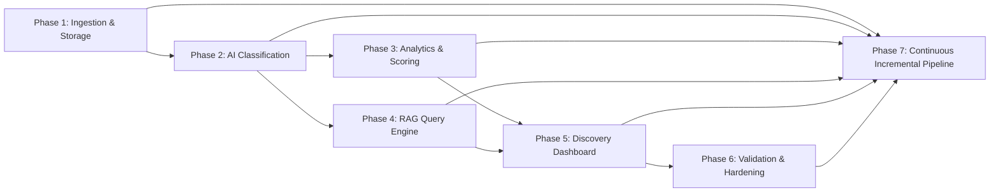

# Phase-Wise Implementation Plan: AI Discovery Engine & Data Pipeline

> **References:** [`context.md`](file:///c:/Users/kumar/Desktop/New%20folder%20(3)/context.md) | [`architecture.md`](file:///c:/Users/kumar/Desktop/New%20folder%20(3)/architecture.md) | [`Docs/problem-statement.txt`](file:///c:/Users/kumar/Desktop/New%20folder%20(3)/Docs/problem-statement.txt) | [`Docs/Update.txt`](file:///c:/Users/kumar/Desktop/New%20folder%20(3)/Docs/Update.txt)

---

## 1. Plan Overview & Delivery Strategy

The goal of this implementation plan is to construct and verify the **AI Discovery Engine**, moving from raw unstructured data ingestion to a continuous incremental pipeline with an interactive, evidence-backed discovery dashboard and natural language querying.

### Architectural Principles Enforced Across All Phases:
- **Zero Hallucination Metrics:** All numbers, counts, and frequencies are computed deterministically; AI is strictly restricted to qualitative semantic extraction.
- **Continuous Incremental Ingestion:** Zero historical reprocessing. Incoming records are deduplicated in $O(1)$ time, and only genuinely new records are sent to the AI classifier.
- **Historical Stability & Locked Baselines:** Historical classifications and timestamps remain immutable unless an explicit re-run is requested.
- **Traceable Ground Truth & Auditability:** Every generated theme, insight, and blocker retains direct linkages to original verbatim quotes, confidence scores, source URLs, and batch audit logs.
- **Fault-Tolerant Multi-Stage Pipeline:** Failed classifications are safely contained and retryable without duplicating data or corrupting historical states.

---

## 2. Phase Breakdown Matrix

| Phase | Focus Area | Deliverables | Status |
| :--- | :--- | :--- | :--- |
| **Phase 1** | Ingestion & Storage Foundation | Parsers, Normalizer, Deduplication, Dual-Layer Database | **COMPLETED & VERIFIED** |
| **Phase 2** | AI Behavioral Classification Layer | Groq LLaMA-3.3 Prompt Engine, Structured Schemas, Confidence Scorer | **COMPLETED & VERIFIED** |
| **Phase 3** | Deterministic Analytics & Clustering | Theme Mapping, Frequency Aggregator, Opportunity Scorer | **COMPLETED & VERIFIED** |
| **Phase 4** | Research Query Layer (RAG) | BM25 In-Memory Index, Hybrid Search, Grounded Citation Synthesizer | **COMPLETED & VERIFIED** |
| **Phase 5** | Interactive Discovery Dashboard | 6 UI Modules (Overview, Blocker Matrix, Categories, Evidence, Opportunities, Assistant) | **COMPLETED & VERIFIED** |
| **Phase 6** | Validation Layer & QA Console | 100-Sample Benchmark Suite (95% Accuracy, $\kappa = 0.9398$), Human Review Console | **COMPLETED & VERIFIED** |
| **Phase 7** | Continuous Incremental Pipeline | State Machine, Isolated Ingestion, Dynamic Recalculation, Audit Logging, Retries | **COMPLETED & VERIFIED** |

---

## 3. End-to-End Dependency & Pipeline Architecture

---

## 4. Detailed Phase Specifications

### Phase 1: Project Setup, Ingestion & Data Foundation
**Goal:** Build a robust, schema-normalized ingestion pipeline that cleans, deduplicates, and stores raw customer feedback records immutably.
- **Deliverables**: `src/models/schema.py`, `src/ingestion/normalizer.py`, `src/ingestion/deduplicator.py`, `src/ingestion/parsers.py`, `src/storage/db.py`.
- **Milestone Verification**: 5/5 unit tests passing (`tests/test_phase1.py`).

---

### Phase 2: AI Behavioral Classification Layer
**Goal:** Build the semantic extraction engine that maps raw text feedback into structured behavioral dimensions with confidence scores and verbatim quotes using Groq LLaMA-3.3-70B.
- **Deliverables**: `src/ai/groq_client.py`, `src/ai/prompts.py`, `src/ai/classifier.py`.
- **Milestone Verification**: 6/6 unit tests passing (`tests/test_phase2.py`).

---

### Phase 3: Deterministic Analytics & Theme Clustering Engine
**Goal:** Build a zero-hallucination analytics engine that deterministically computes frequencies, cross-segment breakdowns, and opportunity priority scores.
- **Deliverables**: `src/analytics/theme_clustering.py`, `src/analytics/aggregator.py`, `src/analytics/opportunity_scorer.py`.
- **Milestone Verification**: 4/4 unit tests passing (`tests/test_phase3.py`).

---

### Phase 4: Research Query Layer (RAG & Natural Language Interface)
**Goal:** Allow researchers to query the behavioral corpus using natural language and receive grounded answers backed by direct user citations.
- **Deliverables**: `src/query/indexer.py`, `src/query/synthesizer.py`, `src/query/service.py`.
- **Milestone Verification**: 5/5 unit tests passing (`tests/test_phase4.py`).

---

### Phase 5: Interactive Discovery Dashboard (Web UI & REST API)
**Goal:** Develop a web interface offering intuitive data exploration, visual analytics, and research query interactions.
- **Deliverables**: `src/api/main.py`, `src/ui/static/index.html`, `src/ui/static/app.js`, `src/ui/static/style.css`.
- **Milestone Verification**: 7/7 integration tests passing (`tests/test_phase5.py`).

---

### Phase 6: Validation Layer, Human-in-the-Loop QA & Hardening
**Goal:** Implement quality control mechanisms, benchmarking against human labels, and prepare comprehensive documentation.
- **Deliverables**: `src/validation/benchmark.py`, `src/validation/reviewer.py`, `Dockerfile`, `docker-compose.yml`.
- **Milestone Verification**: Gold-standard benchmark achieves **95.00% accuracy, 94.80% Macro-F1, Cohen's Kappa $\kappa = 0.9398$** (4/4 tests passing in `tests/test_phase6.py`).

---

### Phase 7: Continuous Incremental Review Ingestion & AI Analysis Pipeline
**Goal:** Enable continuous ingestion of new feedback without reprocessing historical data, maintaining historical stability, complete lineage traceability, failure recovery, and automatic dynamic recalculation of aggregate metrics and search indices (per [`Docs/Update.txt`](file:///c:/Users/kumar/Desktop/New%20folder%20(3)/Docs/Update.txt)).

#### Tasks:
1. **Lifecycle State Machine & Schema Extensions**:
   - Implement `ProcessingStatus` enum: `NEW`, `PROCESSING`, `PROCESSED`, `REQUIRES_REVIEW`, `FAILED`, `HUMAN_APPROVED`.
   - Implement `IngestionAuditReport` Pydantic model and traceability metadata (`model_version`, `error_message`, timestamps).
2. **High-Performance Deduplication & Isolation in DuckDB**:
   - Fast $O(1)$ set lookup methods: `get_existing_record_ids()` and `get_existing_hashes()`.
   - Isolation query `get_unclassified_records()` guaranteeing historical records are never re-sent to the LLM.
   - Failure recovery query `get_failed_records()`.
   - Persistent audit log table `ingestion_audit_log`.
3. **Incremental Pipeline Orchestrator**:
   - Implement `IncrementalPipeline` in `src/pipeline/incremental.py` executing the 10-step continuous lifecycle:
     `Incoming Source -> Ingestion & Normalization -> Composite Deduplication -> Store Raw Data (NEW) -> AI Classification -> Store AI Outputs -> Recalculate Aggregate Metrics & Opportunities -> Refresh In-Memory BM25 Search Index -> Refresh Dashboard -> Log Audit Batch`.
4. **Failure Recovery & Retries**:
   - Implement `retry_failed_records()` to safely reprocess transient failures without modifying historical data or creating duplicates.
5. **CLI & REST API Integration**:
   - CLI subcommands: `ingest-incremental`, `retry-failed`, `audit`.
   - REST endpoints: `POST /api/ingest/incremental`, `POST /api/ingest/retry-failed`, `GET /api/pipeline/audit`, `GET /api/records/{record_id}/lineage`.
6. **Testing & Verification**:
   - Create comprehensive test suite `tests/test_incremental_pipeline.py` verifying deduplication, zero historical reprocessing, historical stability, metric recalculation, traceability, failure recovery, and incremental search index discovery.

**Milestone 7 Completion Gate:** 6/6 tests passing in `tests/test_incremental_pipeline.py`; repeated ingestion rejects duplicates in $< 170\text{ ms}$ with 0 redundant AI calls.

---

## 5. Definition of Done Checklist

- [x] **Data Ingestion:** Successfully ingests CSV, XLSX, and JSON files, normalizes schemas, and deduplicates records.
- [x] **Immutable Evidence:** Raw user statements preserved in original text without alteration.
- [x] **AI Classification:** Extracts intent, blockers, information gaps, comparison behaviors, external sources, and decision triggers with confidence scores.
- [x] **Deterministic Analytics:** Calculates problem frequencies, segment breakdowns, and opportunity scores deterministically without LLM math hallucinations.
- [x] **Opportunity Ranking:** Prioritizes unmet needs using the mathematical scoring formula.
- [x] **Research Query Engine:** Answers qualitative natural-language questions with verified quote citations.
- [x] **Web Dashboard:** Provides intuitive Overview, Problem, Category, Evidence, Opportunity, and Research Assistant modules.
- [x] **Benchmark Evaluation:** Evaluated against 100-sample human benchmark dataset with 95% accuracy and $\kappa = 0.9398$.
- [x] **Continuous Incremental Ingestion:** Ingests new feedback without historical reprocessing, preserves stability, recalculates metrics dynamically, and provides full audit lineage.
- [x] **Full Test Suite:** 38 / 38 pytest tests passing across all test files.
